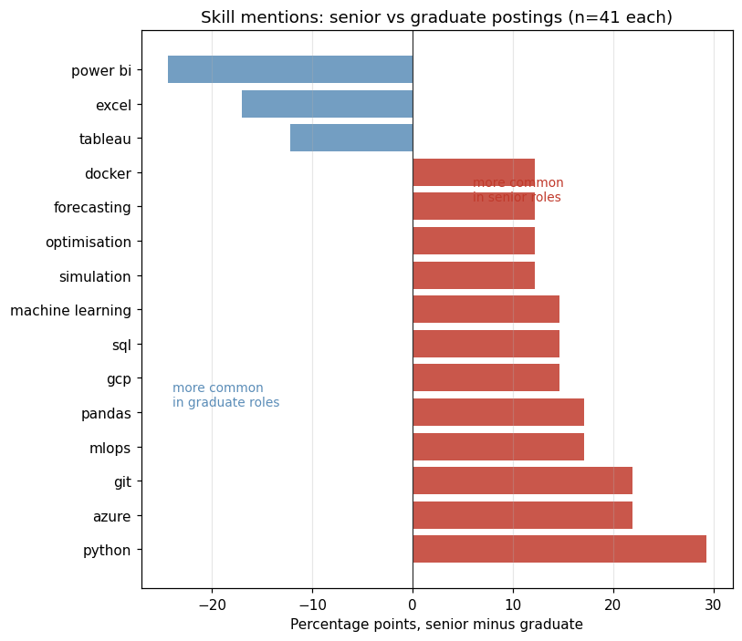
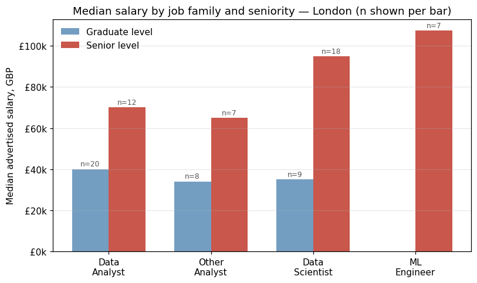

# UK AI/Data Job Market Analysis

Skill demand and visa sponsorship across UK data roles, built from the
Adzuna job board API and the Home Office register of licensed sponsors.

The interesting part of this project is not the numbers — it is what the
data would not support. Several planned analyses were dropped after the
underlying fields turned out to mean something other than their names
suggest. Those decisions are recorded in
[`docs/decisions.md`](docs/decisions.md).

## Data

| Source | What | Size |
|---|---|---|
| Adzuna API | Job postings, 5 keywords × 5 UK regions | 1,336 after dedup |
| Adzuna listing pages | Full JD text, scraped | 214 |
| Home Office | Register of Licensed Sponsors, Skilled Worker route | 122,767 |

The API returns a `description` field truncated at 500 characters, which
is not enough for skill extraction — full text had to be scraped
separately, and scraping is rate-limited, so the JD-level analyses run on
a 214-posting sample rather than all 1,336.

## Pipeline

Notebooks run in order. Each writes to `data/` and the next reads from it.

| Notebook | Does | Re-run cost |
|---|---|---|
| `01_fetch.ipynb` | Adzuna API collection | High — 250 requests/day cap |
| `02_clean.ipynb` | Dedup, unpack nested fields, filter predicted salaries | Low |
| `03_fetch_jd.ipynb` | Scrape full JD text | High — throttled |
| `04_skills.ipynb` | Skill matching, seniority classification | Low |
| `05_sponsorship.ipynb` | Classify visa statements in JD text | Low |
| `06_sponsors.ipynb` | Match employers to the sponsor register | Low |

Collection and analysis are split deliberately: the analysis notebooks can
be re-run freely, the collection ones cannot.

## Reproducing

```bash
pip install -r requirements.txt
```

1. Get an Adzuna API key at https://developer.adzuna.com/ and set
   `APP_ID` / `APP_KEY` at the top of `01_fetch.ipynb`.
2. Download the Skilled Worker register from
   https://www.gov.uk/government/publications/register-of-licensed-sponsors-workers
   and save it as `data/external/sponsors.csv`.
3. Run the notebooks in numerical order.

`data/` is gitignored. The register is republished frequently; results
here use the 2026-08-12 edition.

## Key findings

### Sponsorship status is invisible in job postings, but recoverable from elsewhere

87% of job descriptions say nothing about visa sponsorship. Explicit
refusals appear in 6.5%, explicit offers in 1.4%. Reading postings is
therefore not a way to filter a job search on sponsorship — the
information mostly is not there.

Joining employer names against the Home Office register of licensed
sponsors changes that. After normalising company names and grading each
match by how distinctive the matched token is, **344 of 1,336 postings
(25.8%) can be confirmed as direct employers holding a Skilled Worker
licence** — against the 1.4% derivable from the postings themselves.

This is a floor rather than a census: 60% of employers do not match, and
an unknown share of those are false negatives caused by trading names
that differ from registered ones.

### Entry-level and senior postings ask for different categories of tool

Comparing graduate and senior postings (n=41 each, 68.3% London in both
groups), 29 skills clear a 5% mention threshold. Only three are more
common in graduate postings, and all three are BI tools:

| Skill | Graduate | Senior |
|---|---|---|
| Power BI | 29.3% | 4.9% |
| Excel | 26.8% | 9.8% |
| Tableau | 17.1% | 4.9% |

Every other skill leans senior — Python +29.3pp, Azure and Git +22.0pp
each. Git is mentioned in no graduate posting at all.



### The salary gap between job families is mostly a seniority artefact

Median advertised salaries in London separate cleanly by job family:
data analyst £46k, other analyst £60k, data scientist £95k, ML engineer
£122k.

Splitting by seniority removes most of that separation. At graduate
level the families converge — data analyst £40k (n=20), data scientist
£35k (n=9), other analyst £34k (n=8) — and only diverge at senior level
(£70k / £95k / £65k). The headline spread largely reflects which
seniority levels each family's postings sit at: 20 of 69 data analyst
salaries are graduate-level, against 2 of 32 for ML engineering.



Salary figures cover London only. London share varies by job family
(84% for ML engineering, 61% for the other-analyst group), so pooling
regions distorts comparisons between them as well as absolute levels.

## Engineering notes

The analysis above took nine days. Most of that time went into
discovering that fields did not mean what their names suggested, and
deciding what to do about it. The full record is in
[`docs/decisions.md`](docs/decisions.md); the load-bearing decisions are
these.

**The API's `description` field is truncated at 500 characters.** Median,
75th percentile and maximum are all exactly 500, and 99.8% of values end
in an ellipsis — enough for a company boilerplate, not for a job
specification. Sponsorship statements sit at the end of a posting and
never survive at all. Skill extraction on this field would have sampled
only postings that happen to mention tools early. Full text had to be
scraped from the listing pages instead, which caps the JD-level analyses
at a 214-posting sample rather than all 1,336.

**Throttling accumulates across days, not just within a run.** Scraping
held 77% success through the first 75 requests of one run and 53% through
the last 75; the following day opened at 44% after roughly 300 requests
the day before. Requests are spaced by a random 2–4 seconds, failures are
recorded with their status code rather than dropped, and each batch
reports success rate as it goes — so a run that degrades is visible while
it is still running.

**Keyword matching needs disambiguation, not just word boundaries.**
Naive substring matching put "r" in 100% of postings and "excel" in 58%,
as fragments of *report* and *excellent*. Word boundaries fixed most of
it. Four terms needed more: `r` still matched *R&D*, `excel` still
matched the verb, and `git` and `sql` were now missing GitHub and
PostgreSQL, which do imply the skill. Manual review of eight hits per
term found no remaining false positives.

**Knowing where to stop.** Classifying visa statements hit a wall at
roughly 70% precision. Three failure modes were fixable; the fourth —
words inserted mid-phrase, as in *must have uk right to work* — needs
loose separators that raise false positives, and every new batch of
postings brings new variants. It was left unfixed and the recall gap
documented, because the classified subset was 20 records and no amount of
pattern work would change what could be concluded from it.

**Collection and analysis are separate notebooks** because their re-run
costs differ by orders of magnitude. Collection is bounded by a 250
request/day API quota and by scraping throttle; analysis is local and
runs in seconds. Keeping them in one file would mean triggering a
half-hour collection every time a skill pattern changed.

**A zero in the sample is not a zero in the market.** No posting in the
214-JD sample had "junior" in its title, which read like a fact about UK
hiring conventions. Checking all 1,336 titles found 15. Since then, any
claim about a category gets checked against the full title data before it
is written down.

## Limitations

**Adzuna's `count` is not a job count.** It reports documents containing
the search terms. Relevance decays to nothing well before the reported
total — page 40 of a 2,316-result query returned zero relevant titles.

**JD sample is not fully random.** Scraping succeeds on roughly 60% of
attempts and the failure rate climbs with cumulative requests, so the
214 scraped postings under-represent whatever was requested late in a run.

**Skill matching is keyword-based.** Word boundaries and per-term
disambiguation fix the obvious failures, but the method cannot read
context — a skill listed as desirable counts the same as one listed as
essential.

**Sponsor matching is a floor, not a census.** 60% of employers do not
match the register, and an unknown share of those are false negatives
caused by marketing names that differ from registered ones.

## Repository

```
data/
  raw/          # API output and scraped JD text (gitignored)
  processed/    # cleaned, analysis-ready (gitignored)
  external/     # Home Office register (gitignored)
docs/
  decisions.md  # why each analytical choice was made
notebooks/
```